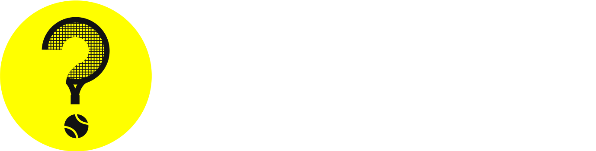

<div align="center">
   <div style="display: flex;padding-block:40px;margin-bottom:20px;background-color:#1f1f1f">
      <picture>
         <source media="(prefers-color-scheme: dark)" srcset="./logos/logo_dark.png">
         <source media="(prefers-color-scheme: light)" srcset="./logos/logo_light.png">
         
      </picture>
   </div>
</div>

# [Tennisdle](https://tennisdle.pivi.dev/)

Tennisdle is a web app where players must guess the daily ATP or WTA tennis player based on clues such as age, height, titles won (Grand Slams, Olympics, Finals), and playing style (dominant hand and backhand type). Project is available at this [link](https://tennisdle.pivi.dev/)

          

## Project structure

```text
.
├── logos
├── scripts
└── tennisdle
```

- `logos`: Contains all the assets used in the app.
- `scripts`: Contains one folder:
  - [Tennsidle DB generator](./scripts/tennisdle-db-generator/README.md): Python script to scrape data from wikipedia and create the database for the Tennisdle web app.
- `tennisdle`: Contains the Vue 3 web app.

## How to use it

1. Clone the repository
2. Navigate to the `tennisdle` folder
   ```bash
   cd tennisdle
   ```
3. Install the dependencies with:
   ```bash
   npm install
   ```
4. Run the app with
   ```bash
   npm start
   ```

## How to deploy

1. Navigate to the `tennisdle` folder
   ```bash
   cd tennisdle
   ```
2. Run the deploy command
   ```bash
   npm run deploy
   ```
