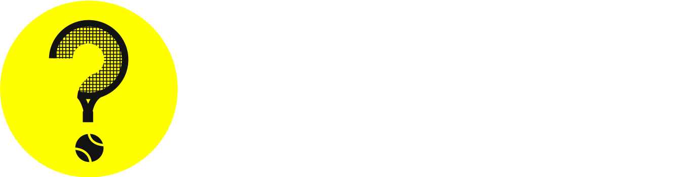

<div align="center">
   <div style="display: flex; padding-block: 40px; margin-bottom: 20px; background-color: #1f1f1f">
      <picture>
         <source media="(prefers-color-scheme: dark)" srcset="./logos/logo_dark.png">
         <source media="(prefers-color-scheme: light)" srcset="./logos/logo_light.png">
         
      </picture>
   </div>
</div>

# [Tennisdle](https://tennisdle.pivi.dev/)

Tennisdle is a web app where players guess tennis players across daily ATP/WTA, image, venue, Top 10, and grid puzzle modes. The project is available at this [link](https://tennisdle.pivi.dev/).

## Recent UI/UX updates

- Shared layout refreshed with better centered content and improved spacing from the fixed navbar.
- Settings moved from a dedicated page to a modal opened from the navbar.
- Grid mode updated with a larger board, better player search behavior, and player image/name hover preview.
- All Players cards restyled to match the current visual system and improved readability/responsiveness.
- Top 10 and grid modes now read ISO-week content files generated from the latest TennisdleDB data.
- Top 10 titles and grid labels are localized directly inside their weekly content files.
- Scrollbars redesigned for a cleaner look.

         

## Project Structure

```text
.
├── logos
└── tennisdle
```

- `logos`: Contains all the assets used in the app.
- `tennisdle`: Contains the Vue 3 web app.

## Data and Weekly Content

The source of truth for player data and weekly game artifacts is the sibling `TennisdleDB` repository. This app only consumes generated JSON files from `tennisdle/src/assets/db`.

Weekly game files use ISO week numbering:

```text
top10_<week>_<year>.json
grid_puzzles_<week>_<year>.json
```

Examples:

```text
top10_23_2026.json
grid_puzzles_23_2026.json
```

### Top 10 schema

Each weekly Top 10 file contains every supported Top 10 game. The file is regenerated every week so values stay retroactively fresh when player stats change.

```json
{
  "id": "most-grand-slams-atp",
  "date": "2026-06-02",
  "titleOptions": {
    "en-US": "Most Grand Slam titles (ATP)",
    "it-IT": "Più titoli Slam (ATP)"
  },
  "isAtp": true,
  "players": [
    { "rank": 1, "player": "Novak Djokovic", "value": 24 }
  ]
}
```

There is no `title` or `titleKey`; UI labels come from `titleOptions`.

### Grid puzzle schema

Each weekly grid file contains seven daily puzzles, one for each day of the ISO week. Categories are embedded in the puzzle rows and columns, so there is no separate `grid_categories.json`.

```json
{
  "id": "puzzle-2026-06-02",
  "date": "2026-06-02",
  "rows": [
    {
      "id": "grand-slam-winner",
      "label": { "en-US": "Won a Grand Slam", "it-IT": "Ha vinto uno Slam" },
      "shortLabel": { "en-US": "Grand Slam winner", "it-IT": "Vincitore Slam" }
    }
  ],
  "cols": [],
  "solutions": {}
}
```

### Updating data

From the sibling `TennisdleDB` repo:

```bash
uv run python scripts/generate_content_now.py
```

Copy the generated files from `TennisdleDB/examples` into `tennisdle/src/assets/db`:

- `atp_players.json`
- `atp_players_filtered.json`
- `wta_players.json`
- `wta_players_filtered.json`
- `venues.json`
- `top10_<week>_<year>.json`
- `grid_puzzles_<week>_<year>.json`

The app resolves the current ISO-week file automatically. If that exact week is missing, it falls back to the latest bundled weekly artifact so local builds remain playable.

## How to Use

1. Clone the repository:
   ```bash
   git clone https://github.com/thisispivi/Tennisdle.git
   ```
2. Navigate to the `tennisdle` folder:
   ```bash
   cd tennisdle
   ```
3. Install the dependencies:
   ```bash
   pnpm i
   ```
4. Run the app:
   ```bash
   pnpm dev
   ```

## How to Deploy

1. Navigate to the `tennisdle` folder:
   ```bash
   cd tennisdle
   ```
2. Run the deploy command:
   ```bash
   pnpm deploygh
   ```
